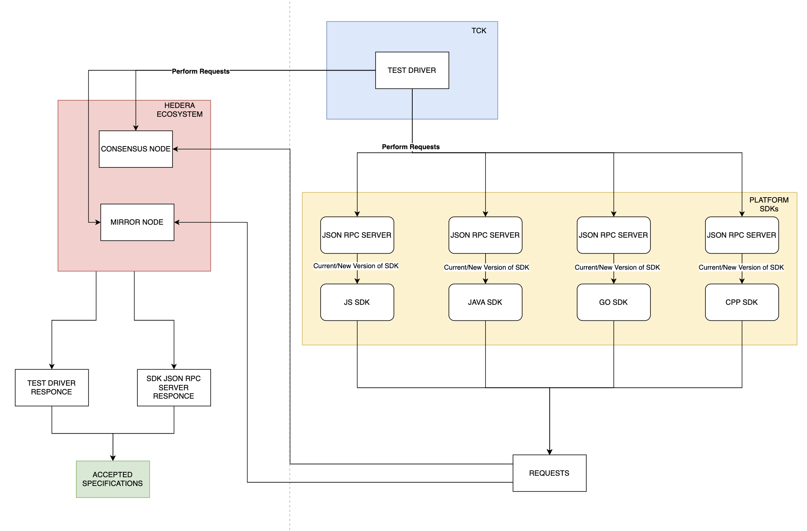

# Client SDK TCK

## Requirements

- A single TCK that can work with *any* client SDK
- Test driver must be able to run all tests and verify all results
- Minimal work on the client SDK

## Proposal

The TCK is a TypeScript project that produces an NPM executable. It is made up
of a test driver, and manages the lifecycle of a hedera network. The client
SDK (the “SDK” or “SDK under test”) will implement a JSON-RPC server
implementing a JSON-RPC API defined by the TCK. For each test, the TCK will make
one or more calls to the SDK’s JSON-RPC server endpoint, and using a combination
of responses from the SDK’s JSON-RPC server and the mirror and consensus nodes,
determine the pass/fail/incomplete status of each test.

### Requirements

1. The hedera network must support at least 4 nodes, so one can be shut down
   without affecting consensus.
2. The hedera network will be a local network setup by the TCK
3. The TCK will be an executable NPM module.
4. The JSON-RPC server for the SDK must be started prior to running the TCK.
5. The TCK must take configuration, requiring the endpoint of the JSON-RPC
   server for the SDK
6. Additional config that a user may set include: report output path,
   color/no-color for console output, set of tests to execute (ability to run
   subset of tests)

### Guidance

The hedera network ideally would be a hedera-local-node, which would mean adding
support for multiple nodes to the hedera-local-node (Issue is already filed)

### JSON-RPC API Examples

#### Setup

1. `setup`: includes configuration for the SDK client to use for the network:
    1. IP of the nodes in the network
    2. IP of the mirror node
    3. Personas for operators, their accounts, and their private keys

#### Account Management

1. `getAccountInfo`: Supports getting account info for a specific account
    1. Includes the account ID OR alias of the account to get information for,
       and which operator to use
    2. Returns the account Info as JSON (to be specified) or error code if it
       doesn’t work
2. `createAccount`: Creates an account using the operator specified in the
   JSON-RPC call
    1. Option alias included in the call
    2. Returns the receipt, or error code
